# 🚗 Vietnamese Automotive Pre-RAG Data Pipeline

Hệ thống **Pre-RAG Data Pipeline** độc lập, chuẩn hóa chuyên sâu cho **Tiếng Việt** và **Tư vấn Mua bán & Pháp lý sở hữu ô tô điện**.

Pipeline xử lý trọn vẹn quy trình phân tầng **Medallion Architecture (Raw Ingestion $\to$ Bronze $\to$ Silver $\to$ Gold)**: Khám phá nguồn URLs, bóc tách cấu trúc đa định dạng (Rolling API, HTML FAQ, Tin bài ưu đãi, Brochure kỹ thuật & Văn bản pháp lý PDF), chuẩn hóa dấu thanh Unicode NFC, phân đoạn ngữ cảnh phân cấp (**Hierarchical Chunking** gắn breadcrumb tiêu đề) và lọc sạch tri thức không phục vụ tư vấn mua bán xe.

> [!NOTE]
> Hệ thống tuân thủ nghiêm ngặt nguyên tắc **Pre-RAG**: Thu thập, làm sạch, cấu trúc hóa và đóng gói semantic chunks chất lượng cao sẵn sàng cho tầng Indexing / Vector Embedding phía sau mà không bị phụ thuộc vào bất kỳ thư viện mô hình nhúng hay cơ sở dữ liệu vector cụ thể nào.

---

## 📁 1. Cấu trúc thư mục chuẩn hóa Repository

Dự án được tái cấu trúc tinh gọn theo chuẩn Python Package hiện đại:
- **Cây thư mục gốc**: Duy nhất **2 thư mục**: `dataset/` (kho dữ liệu phân tầng) và `src/` (mã nguồn).
- **Trong `src/`**: Duy nhất **1 thư mục đóng gói toàn bộ pipeline**: `src/pipeline/`.

```text
P-097-Data/
├── dataset/                              # Kho lưu trữ dữ liệu phân tầng Medallion
│   ├── bronze/                           # Dữ liệu thô ban đầu (Raw API JSON, HTML, PDF)
│   │   ├── vinfast/
│   │   │   ├── articles/                 # 18 bài viết chương trình ưu đãi HTML
│   │   │   ├── faq/                      # vinfast_faq_raw.html (400 câu hỏi-đáp)
│   │   │   └── relational/               # Snapshot API giá niêm yết & chi phí lăn bánh
│   │   └── web_scraping/                 # Bài viết trải nghiệm & tài chính ngân hàng
│   ├── silver/                           # Dữ liệu đã chuẩn hóa, bóc tách và phân đoạn
│   │   ├── rdb_schema/                   # 5 bảng CSV số liệu quan hệ (Toàn bộ danh mục)
│   │   ├── silver_chunks.jsonl           # 2,801 chunks ngữ cảnh phân cấp có breadcrumbs
│   │   ├── silver_documents.jsonl        # 113 tài liệu đã làm sạch boilerplate
│   │   ├── silver_faq.jsonl              # 400 cặp Q&A nguyên bản từ Accordion FAQ
│   │   ├── silver_vehicles.jsonl         # 27 phiên bản xe kèm giá và thông số
│   │   └── silver_report.json            # Báo cáo thống kê tầng Silver
│   ├── gold/                             # Dữ liệu tinh tuyển phục vụ Tư vấn Mua xe
│   │   ├── rdb_schema/                   # 5 bảng CSV quan hệ chuyên sâu ô tô điện
│   │   ├── gold_chunks.jsonl             # 2,004 chunks ngữ cảnh tinh chọn (71.55% giữ lại)
│   │   ├── gold_documents.jsonl          # 112 tài liệu được chứng nhận tư vấn
│   │   ├── gold_faq.jsonl                # 400 câu hỏi-đáp tư vấn khách hàng
│   │   ├── gold_vehicles.jsonl           # 27 phiên bản ô tô điện hoàn chỉnh
│   │   └── gold_report.json              # Báo cáo phân bổ 7 chủ đề tư vấn mua xe
│   ├── pdf/                              # Tài liệu kỹ thuật, brochure & văn bản pháp lý
│   │   ├── chinh_sach_uu_dai/            # 14 văn bản chính sách bán hàng & VinClub
│   │   ├── thong_so_ky_thuat/            # 10 brochure thông số xe điện (VF 3 - VF 9)
│   │   ├── thu_tuc_phap_ly/              # 11 văn bản pháp lý (Nghị định & Thông tư)
│   │   └── pdf_manifest.json             # Chỉ mục 35 tệp PDF kèm metadata
│   └── sources.csv                       # 39 URL hạt giống đã kiểm chứng & phân loại
│
├── src/                                  # Thư mục mã nguồn
│   └── pipeline/                         # Gói pipeline duy nhất đóng gói toàn bộ hệ thống
│       ├── __init__.py                   # Package export: PreRAGPipeline, PipelineConfig,...
│       ├── __main__.py                   # Module entrypoint (python -m src.pipeline)
│       ├── cli.py                        # Giao diện dòng lệnh CLI (crawl, silver, gold, run, stats, sample)
│       ├── config.py                     # Cấu hình đường dẫn động, ngưỡng lọc & chunking
│       ├── bronze_to_silver.py           # Pipeline chuyển đổi Bronze -> Silver
│       ├── silver_to_gold.py             # Pipeline lọc & phân loại Silver -> Gold
│       ├── orchestrator.py               # PreRAGPipeline điều phối toàn trình
│       ├── chunking/                     # Phân đoạn văn bản ngữ cảnh
│       │   ├── __init__.py
│       │   └── hierarchical_chunker.py   # Hierarchical Chunker bảo toàn cấu trúc bảng & heading
│       ├── crawlers/                     # Thu thập dữ liệu từ Web/API
│       │   ├── __init__.py
│       │   ├── raw_crawler.py            # Crawler tải Rolling API, FAQ, Tin ưu đãi, PDF
│       │   └── url_discoverer.py         # Quét danh mục hạt giống, chặn xe máy & URL rác
│       ├── extractors/                   # Bóc tách dữ liệu có cấu trúc từ Bronze & PDF
│       │   ├── __init__.py
│       │   ├── base.py                   # Interface trừu tượng BaseExtractor
│       │   ├── faq_extractor.py          # Bóc tách 400 câu hỏi-đáp từ FAQ HTML
│       │   ├── html_article_extractor.py # Bóc tách tin tức, loại bỏ boilerplate
│       │   ├── pdf_extractor.py          # Trích xuất PDF brochure xe & pháp lý
│       │   └── relational_extractor.py   # Phân giải bảng giá xe & ma trận lăn bánh 63 tỉnh
│       ├── filters/                      # Bộ lọc tri thức chuyên biệt
│       │   ├── __init__.py
│       │   └── gold_filter.py            # Lọc bỏ nội dung không liên quan, gắn thẻ 7 chủ đề
│       ├── models/                       # Schemas dữ liệu chuẩn
│       │   ├── __init__.py
│       │   └── schemas.py                # BronzeDocument, SilverDocument, SilverChunk, SilverFAQItem,...
│       ├── nlp/                          # Xử lý ngôn ngữ tự nhiên Tiếng Việt
│       │   ├── __init__.py
│       │   ├── sentence_splitter.py      # Tách câu bảo toàn từ viết tắt (TP.HCM, VNĐ, km/h)
│       │   ├── vietnamese_normalizer.py  # Chuẩn hóa Unicode NFC & chuẩn dấu thanh mới (oà -> hòa)
│       │   └── vietnamese_quality.py     # Đánh giá chất lượng, lọc watermark & nhiễu in ấn
│       ├── storage/                      # Quản lý đọc/ghi JSONL & CSV
│       │   ├── __init__.py
│       │   ├── silver_writer.py          # Xuất dữ liệu tầng Silver
│       │   └── gold_writer.py            # Xuất dữ liệu tầng Gold
│       └── tests/                        # 16 Unit & Integration Tests tự động
│           ├── __init__.py
│           ├── conftest.py               # Thiết lập môi trường kiểm thử pytest
│           ├── test_crawlers.py          # Kiểm thử Crawler & URL Discoverer
│           ├── test_gold_filter.py       # Kiểm thử logic lọc tri thức Gold
│           ├── test_hierarchical_chunker.py # Kiểm thử chunking phân cấp & breadcrumb
│           ├── test_pipeline_integration.py # Kiểm thử luồng tích hợp end-to-end
│           ├── test_sentence_splitter.py # Kiểm thử tách câu tiếng Việt
│           └── test_vietnamese_normalizer.py # Kiểm thử chuẩn hóa NFC & dấu thanh
│
├── .gitignore                            # Cấu hình bỏ qua tệp tạm, cache, venv
├── pyproject.toml                        # Cấu hình gói tiêu chuẩn PEP 518/621
├── README.md                             # Tài liệu tổng quan toàn bộ dự án
└── requirements.txt                      # Danh sách thư viện phụ thuộc
```

---

## 🏗️ 2. Kiến trúc phân tầng Medallion & Luồng xử lý dữ liệu

```mermaid
flowchart TD
    subgraph Discovery ["1. Khám phá Nguồn (URL Discovery)"]
        D1["UrlDiscoverer (url_discoverer.py)"]
        D2["dataset/sources.csv (39 nguồn sạch đã kiểm chứng)"]
        D3["Chặn triệt để xe máy, xe đạp điện, e-scooter & web luật tổng hợp"]
    end

    subgraph Crawl ["2. Thu thập dữ liệu thô (Bronze Layer)"]
        C1["VinFast Rolling API -> dataset/bronze/vinfast/relational/"]
        C2["VinFast FAQ HTML -> dataset/bronze/vinfast/faq/"]
        C3["EV Promo Articles -> dataset/bronze/vinfast/articles/"]
        C4["Brochures & Policies -> dataset/pdf/thong_so_ky_thuat/ & chinh_sach_uu_dai/"]
        C5["External Articles -> dataset/bronze/web_scraping/"]
    end

    subgraph Silver ["3. Chuẩn hóa & Phân đoạn Ngữ cảnh (Silver Layer)"]
        S1["Unicode NFC & Chuẩn hóa dấu thanh Tiếng Việt (hoà -> hòa)"]
        S2["Tách câu bảo toàn từ viết tắt (TP.HCM, VNĐ, 60,13 kWh)"]
        S3["Loại bỏ Boilerplate rác & Print Noise (about:blank, watermark)"]
        S4["Hierarchical Heading Tracker (Gắn breadcrumb context vào chunk)"]
        S5["Bảo toàn bảng biểu Markdown (| Header | ... |)"]
        S6["dataset/silver/silver_chunks.jsonl (2,801 chunks)"]
    end

    subgraph GoldFilter ["4. Bộ lọc Tư vấn Mua Bán Xe (Gold Consultation Filter)"]
        GF1{"Phân loại nội dung"}
        DROP["LOẠI BỎ (797 chunks - 28.45%):<br/>• Quy tắc điều khiển phương tiện (bật đèn, bấm còi, qua phà, hầm)<br/>• Xử phạt vi phạm giao thông (NĐ 100/2019, NĐ 123/2021)<br/>• Cải tạo & hoán cải kết cấu khung gầm cơ khí<br/>• Thể thức văn bản hành chính không liên quan"]
        KEEP["GIỮ LẠI (2,004 chunks - 71.55%):<br/>• Giá bán niêm yết & Dự toán chi phí lăn bánh 63 tỉnh<br/>• Thông số kỹ thuật & Kinh nghiệm chọn xe điện<br/>• Chương trình ưu đãi, khuyến mại & VinClub<br/>• Thủ tục pháp lý: Đăng ký, Biển số định danh, Lệ phí trước bạ, Bảo hiểm TNDS<br/>• Chính sách Pin, Thuê pin & Trạm sạc V-GREEN<br/>• Tài chính, Gói vay ngân hàng & Trả góp<br/>• Bảo hành 10 năm & Dịch vụ hậu mãi"]
    end

    subgraph Gold ["5. Kho tri thức Tinh tuyển Tư vấn Mua Xe (Gold Layer)"]
        G1["gold_chunks.jsonl (2,004 chunks ngữ cảnh kèm thẻ chủ đề)"]
        G2["gold_faq.jsonl (400 câu hỏi - đáp tư vấn khách hàng)"]
        G3["gold_vehicles.jsonl (27 phiên bản xe, pin và giá lăn bánh)"]
        G4["gold_documents.jsonl (112 tài liệu đã làm sạch)"]
        G5["gold/rdb_schema/ (5 bảng CSV số liệu quan hệ ô tô điện)"]
        G6["gold_report.json (Báo cáo chỉ số toàn vẹn)"]
    end

    Discovery --> Crawl
    Crawl --> Silver
    Silver --> GF1
    GF1 -->|Nhiễu / Không phục vụ mua bán| DROP
    GF1 -->|Phục vụ tư vấn mua xe| KEEP
    KEEP --> Gold
```



---

## 📊 3. Chi tiết các tệp dữ liệu đầu ra và Vai trò trong Hệ thống RAG

| Tệp dữ liệu | Số lượng bản ghi | Định dạng | Mục đích & Vai trò kiến trúc trong RAG |
| :--- | :---: | :---: | :--- |
| **`gold_chunks.jsonl`** | **2,004 chunks** | JSONL | **Kho tri thức phục vụ Semantic Vector Search (Dense Retrieval)**.<br/>Mỗi chunk có kích thước $\approx 512$ ký tự, được chèn sẵn ngữ cảnh breadcrumb (`[VF 8 > Chính sách pin]`) và nhãn chủ đề (`gold_topic`), đảm bảo mô hình Embedding thu nhận trọn vẹn ngữ nghĩa mà không bị cụt câu. |
| **`gold_faq.jsonl`** | **400 Q&A** | JSONL | **Bộ câu hỏi - đáp chuẩn phục vụ Semantic Routing & Cache**.<br/>Trước khi kích hoạt chuỗi RAG tốn kém, hệ thống so khớp câu hỏi của người dùng với danh sách câu hỏi chuẩn này. Nếu độ tương đồng cao ($\ge 0.92$), trả về ngay câu trả lời chính thức được kiểm duyệt, tránh hoàn toàn rủi ro hallucination. |
| **`gold_vehicles.jsonl`** | **27 mẫu xe** | JSONL | **Danh mục thông số & giá xe chi tiết**.<br/>Tổng hợp cấu hình, dung lượng pin, quãng đường di chuyển và giá niêm yết theo từng phiên bản xe điện VinFast (VF 3, VF 5, VF 6, VF 7, VF 8, VF 9,...). |
| **`gold_documents.jsonl`** | **112 tài liệu** | JSONL | **Tài liệu toàn văn sạch**.<br/>Lưu trữ toàn bộ nội dung tài liệu sau khi loại bỏ boilerplate, header/footer in ấn và watermark, phục vụ tác vụ đọc hiểu toàn văn hoặc summarize. |
| **`rdb_schema/*.csv`** | **5 bảng CSV** | CSV | **Cơ sở dữ liệu quan hệ (Structured Query / Text-to-SQL)**.<br/>Bao gồm: `cars_catalog.csv` (14 dòng), `trims_pricing.csv` (27 dòng), `provinces.csv` (63 tỉnh), `fee_rules.csv` (6 quy tắc tính phí) và `rolling_cost_matrix.csv` (162 dòng chi phí lăn bánh chính xác từng đồng). |
| **`gold_report.json`** | 1 báo cáo | JSON | Báo cáo kiểm định chất lượng: Tỷ lệ giữ lại, thời gian xử lý và phân bổ theo 7 chủ đề tư vấn mua xe. |

### ❓ Phân biệt giữa `gold_chunks.jsonl` và `gold_faq.jsonl`
1. **Nội dung FAQ CÓ nằm trong `gold_chunks.jsonl`**: Khi chạy pipeline, toàn bộ 400 câu FAQ được gom thành các tài liệu chuyên đề và cắt thành các chunk ngữ cảnh phân cấp để phục vụ tìm kiếm ngữ nghĩa tự do khi khách hàng hỏi các câu hỏi mở.
2. **Đồng thời FAQ được tách riêng thành `gold_faq.jsonl` độc lập**: Giữ nguyên cấu trúc cặp `{question, answer, category}` để làm **Semantic Router/Cache tầng 1** và **Few-shot examples** chất lượng cao nhồi vào prompt cho LLM.

---

## ⚡ 4. Hướng dẫn cài đặt & Khởi chạy

### 4.1. Yêu cầu hệ thống
- **Python**: Phiên bản 3.9 trở lên (Khuyến nghị Python 3.10 - 3.14).
- **Hệ điều hành**: Hỗ trợ đầy đủ Windows, macOS và Linux.

### 4.2. Cài đặt môi trường
Tạo và kích hoạt môi trường ảo:
```bash
# Tạo virtual environment
python -m venv .venv

# Kích hoạt trên Windows PowerShell:
.venv\Scripts\Activate.ps1

# Kích hoạt trên Linux/macOS:
source .venv/bin/activate
```

Cài đặt các gói phụ thuộc:
```bash
pip install -r requirements.txt
```
*(Tùy chọn)* Cài đặt chế độ phát triển (editable package):
```bash
pip install -e .
```

---

## 🚀 5. Hướng dẫn sử dụng CLI

Hệ thống cung cấp giao diện dòng lệnh linh hoạt thông qua module `src.pipeline`:

### 5.1. Chạy toàn bộ Pipeline (End-to-End Pre-RAG)
Chuyển đổi toàn trình từ Bronze $\to$ Silver $\to$ Gold chỉ trong một lệnh duy nhất:
```bash
python -m src.pipeline run
```
*(Nếu muốn chạy cả bước Crawler trước khi xử lý)*:
```bash
python -m src.pipeline run --crawl
```

### 5.2. Chạy từng bước độc lập
- **Chạy chuyển đổi Bronze $\to$ Silver**:
  ```bash
  python -m src.pipeline silver
  ```
- **Chạy lọc & phân loại Silver $\to$ Gold**:
  ```bash
  python -m src.pipeline gold
  ```
- **Chạy Crawler thu thập dữ liệu thô**:
  ```bash
  python -m src.pipeline crawl --mode all
  ```

### 5.3. Xem thống kê báo cáo (Stats)
Xem báo cáo chỉ số và phân bổ chủ đề của tầng Gold:
```bash
python -m src.pipeline stats --stage gold
```
Xem báo cáo tầng Silver:
```bash
python -m src.pipeline stats --stage silver
```

### 5.4. Xem mẫu dữ liệu (Sample)
Xem 2 bản ghi mẫu từ `gold_chunks.jsonl`:
```bash
python -m src.pipeline sample --stage gold --type chunks -n 2
```
Xem mẫu câu hỏi FAQ:
```bash
python -m src.pipeline sample --stage gold --type faq -n 2
```
Xem mẫu bảng giá xe:
```bash
python -m src.pipeline sample --stage gold --type vehicles -n 2
```

---

## 🧪 6. Kiểm thử tự động (Unit & Integration Tests)

Hệ thống đi kèm **16 bài kiểm thử tự động**, bao phủ 100% các thành phần cốt lõi:
- `test_vietnamese_normalizer`: Kiểm tra chuẩn hóa Unicode NFC và chuẩn dấu thanh tiếng Việt mới.
- `test_sentence_splitter`: Kiểm tra tách câu bảo toàn từ viết tắt, số tiền và đơn vị đo lường.
- `test_hierarchical_chunker`: Kiểm tra giữ nguyên bảng biểu Markdown và tiêm breadcrumb tiêu đề phân cấp.
- `test_gold_filter`: Kiểm tra lọc bỏ luật phạt vi phạm giao thông, giữ lại thông tin mua bán xe.
- `test_crawlers`: Kiểm tra cơ chế chặn xe máy và lọc nguồn hạt giống hợp lệ.
- `test_pipeline_integration`: Kiểm thử toàn bộ luồng tích hợp Bronze $\to$ Silver end-to-end.

Chạy toàn bộ kiểm thử:
```bash
python -m pytest -q
```
**Kết quả mong đợi:**
```text
................                                                         [100%]
16 passed in 9.41s
```

---

## 🎯 7. Các đặc tính kỹ thuật nổi bật

1. **Chuẩn hóa Tiếng Việt chuyên sâu**:
   - Tự động chuyển đổi toàn bộ ký tự sang Unicode tổ hợp dựng sẵn (NFC).
   - Chuẩn hóa dấu thanh theo kiểu gõ hiện đại (`hoà` $\to$ `hòa`, `thuỷ` $\to$ `thủy`).
   - Tách câu thông minh không bị ngắt quãng bởi các từ viết tắt phổ biến (`TP.HCM`, `VNĐ`, `TS.`, `km/h`, số tiền `260.000.000 VNĐ`).

2. **Phân đoạn ngữ cảnh phân cấp (Hierarchical Chunking)**:
   - Theo dõi cấu trúc tiêu đề Markdown từ `#` đến `######`.
   - Tiêm trực tiếp đường dẫn breadcrumb vào phần đầu của mỗi đoạn văn (ví dụ: `[VF 8 > Chính sách bảo hành]`).
   - Bảo toàn nguyên khối các bảng biểu Markdown (`| Cột 1 | Cột 2 |`), ngăn ngừa tình trạng bảng giá bị cắt đứt giữa chừng.

3. **Lọc tri thức chuyên biệt cho Tư vấn Mua Bán Xe**:
   - Sử dụng bộ lọc từ khóa phủ định và regex để loại bỏ hơn 28% nội dung rác (các quy định xử phạt vi phạm giao thông theo Nghị định 100/2019, kỹ thuật hoán cải khung sườn cơ khí).
   - Tự động gắn thẻ 7 chủ đề tư vấn mua xe then chốt: `bao_gia_chi_phi`, `thong_so_va_chon_xe`, `chinh_sach_uu_dai`, `thu_tuc_phap_ly_so_huu`, `pin_va_tram_sac`, `tai_chinh_tra_gop`, `bao_hanh_hau_mai`.
