# 🚗 WeKnora Vietnamese Pre-RAG Data Pipeline

Hệ thống Data Pipeline tiền RAG (**Pre-RAG: Crawling $\to$ Bronze $\to$ Silver $\to$ Gold Chunks**) độc lập, chuyên biệt cho **Tiếng Việt** và **Tư vấn Mua bán xe & Pháp lý sở hữu ô tô điện**.

Pipeline xử lý trọn vẹn từ **chưa có gì** (khám phá URLs, cào API, HTML và PDFs) đến **chuẩn hóa dữ liệu, chunking ngữ cảnh phân cấp (Hierarchical Chunking) và lọc sạch nhiễu/nội dung không liên quan**.

> [!NOTE]
> Thư mục `src/` tuân thủ nguyên tắc **Pre-RAG**: Chỉ xử lý dữ liệu và tạo chunks ngữ cảnh chuẩn bị cho RAG. Không tích hợp embedding models hay vector database (giai đoạn embedding thuộc tầng indexing phía sau).

---

## 🏗️ 1. Kiến trúc phân tầng Medallion & Pre-RAG Pipeline

```mermaid
flowchart TD
    subgraph Discovery ["1. Khám phá & Quản lý Nguồn (URL Discovery)"]
        D1["UrlDiscoverer (src/crawlers/url_discoverer.py)"]
        D2["dataset/sources.csv (42+ hạt giống kiểm chứng & phân loại 7 nhóm)"]
        D3["Loại trừ xe máy, xe đạp điện, e-scooter, giá trôi nổi bên ngoài"]
    end

    subgraph Crawl ["2. Thu thập dữ liệu thô (Bronze Ingestion)"]
        C1["VinFast Rolling API -> dataset/bronze/vinfast/relational/"]
        C2["VinFast FAQ HTML -> dataset/bronze/vinfast/faq/"]
        C3["EV Promo Articles -> dataset/bronze/vinfast/articles/"]
        C4["Brochures & Policies -> dataset/pdf/thong_so_ky_thuat/ & chinh_sach_uu_dai/"]
        C5["External Articles (Techcombank, Bảo Việt, XeHay) -> dataset/bronze/web_scraping/"]
    end

    subgraph Silver ["3. Chuẩn hóa & Phân đoạn Ngữ cảnh (Silver Layer)"]
        S1["Unicode NFC & Chuẩn hóa dấu thanh Tiếng Việt (hoà -> hòa)"]
        S2["Tách câu thông minh bảo toàn từ viết tắt (TP.HCM, VNĐ, 60,13 kWh)"]
        S3["Loại bỏ Boilerplate rác & Print Noise (about: blank)"]
        S4["Hierarchical Heading Tracker (Gắn breadcrumb context)"]
        S5["Bảo toàn bảng biểu Markdown (| Header | ... |)"]
        S6["dataset/silver/silver_chunks.jsonl (2,865 chunks)"]
    end

    subgraph GoldFilter ["4. Bộ lọc Tư vấn Mua Bán Xe (Gold Consultation Filter)"]
        GF1{"Phân loại nội dung"}
        DROP["LOẠI BỎ (815 chunks - 28.45%):<br/>- Quy tắc điều khiển phương tiện (bật đèn, bấm còi, qua phà, hầm)<br/>- Xử phạt vi phạm giao thông đường bộ<br/>- Cải tạo xe & hoán cải kết cấu khung gầm cơ khí<br/>- Thể thức văn bản hành chính không liên quan"]
        KEEP["GIỮ LẠI (2,050 chunks - 71.55%):<br/>- Giá bán niêm yết & Dự toán chi phí lăn bánh<br/>- Thông số kỹ thuật & Đánh giá trải nghiệm chọn xe<br/>- Chương trình ưu đãi & Khuyến mại EV<br/>- Thủ tục pháp lý: Đăng ký, Biển số định danh, Lệ phí trước bạ, Bảo hiểm TNDS<br/>- Chính sách Pin & Hệ thống trạm sạc V-GREEN<br/>- Tài chính, Gói vay ngân hàng & Trả góp<br/>- Bảo hành 10 năm & Dịch vụ hậu mãi 24/7"]
    end

    subgraph Gold ["5. Kho tri thức Tư vấn Mua xe Tinh tuyển (Gold Layer)"]
        G1["gold_chunks.jsonl (2,050 chunks ngữ cảnh kèm thẻ chủ đề)"]
        G2["gold_faq.jsonl (400 câu hỏi - đáp tư vấn khách hàng)"]
        G3["gold_vehicles.jsonl (27 phiên bản xe, pin và giá lăn bánh)"]
        G4["gold_documents.jsonl (112 tài liệu đã làm sạch)"]
        G5["gold_report.json (Báo cáo chỉ số toàn vẹn)"]
    end

    Discovery --> Crawl
    Crawl --> Silver
    Silver --> GF1
    GF1 -->|Không liên quan mua bán| DROP
    GF1 -->|Phục vụ tư vấn mua xe| KEEP
    KEEP --> Gold
```



---

## 📁 2. Cấu trúc thư mục mã nguồn độc lập (`src/`)

```text
src/
├── crawlers/                     # Module cào và phát hiện nguồn dữ liệu thô
│   ├── __init__.py
│   ├── url_discoverer.py         # Quét danh mục hạt giống & feed động, loại bỏ xe máy/nhiễu
│   └── raw_crawler.py            # Cào VinFast API, FAQ, Tin ưu đãi, Brochure & văn bản PDF
├── extractors/                   # Bóc tách dữ liệu có cấu trúc từ Bronze & PDF
│   ├── base.py                   # Base extractor interface
│   ├── faq_extractor.py          # Bóc tách 400 câu hỏi - đáp từ FAQ HTML
│   ├── html_article_extractor.py # Bóc tách bài viết tin tức, làm sạch boilerplate
│   ├── pdf_extractor.py          # Trích xuất PDF văn bản pháp lý & brochure xe
│   └── relational_extractor.py   # Phân giải JSON API xe & ma trận chi phí lăn bánh 63 tỉnh
├── nlp/                          # Xử lý ngôn ngữ tự nhiên Tiếng Việt chuyên sâu
│   ├── vietnamese_normalizer.py  # Chuẩn hóa Unicode NFC, dấu thanh chuẩn, khoảng trắng
│   ├── sentence_splitter.py      # Tách câu bảo toàn từ viết tắt, số thập phân, tiền tệ
│   └── vietnamese_quality.py     # Đo tỷ lệ dấu tiếng Việt, lọc boilerplate & print noise
├── chunking/                     # Phân đoạn văn bản ngữ cảnh phân cấp
│   └── hierarchical_chunker.py   # Theo dõi tiêu đề #, ##, ###, tiêm breadcrumbs, giữ nguyên bảng
├── filters/                      # Bộ lọc tri thức chuyên biệt
│   └── gold_filter.py            # Lọc bỏ nội dung không liên quan mua bán xe, gắn thẻ 7 chủ đề
├── models/                       # Data schemas (Pydantic / dataclasses)
│   └── schemas.py                # BronzeDocument, SilverDocument, SilverChunk, SilverFAQItem, SilverVehicle
├── storage/                      # Lưu trữ tệp dữ liệu phân tầng (JSONL / JSON)
│   ├── silver_writer.py          # Ghi kết quả tầng Silver
│   └── gold_writer.py            # Ghi kết quả tầng Gold
├── pipeline/                     # Bộ điều phối Pipeline
│   ├── bronze_to_silver.py       # Pipeline Bronze -> Silver
│   ├── silver_to_gold.py         # Pipeline Silver -> Gold
│   └── orchestrator.py           # PreRAGPipeline điều phối từ Crawl -> Silver -> Gold
├── tests/                        # 16 unit tests kiểm thử 100% tính đúng đắn
│   ├── test_crawlers.py
│   ├── test_gold_filter.py
│   ├── test_hierarchical_chunker.py
│   ├── test_pipeline_integration.py
│   ├── test_sentence_splitter.py
│   └── test_vietnamese_normalizer.py
├── cli.py                        # Giao diện dòng lệnh CLI đầy đủ
├── config.py                     # Cấu hình đường dẫn và siêu tham số
└── README.md
```

---

## 📑 3. Dọn dẹp & Tổ chức Kho PDF (`dataset/pdf/`)

### 3.1. Thư mục Thủ tục pháp lý (`dataset/pdf/thu_tuc_phap_ly/`)
Đã sàng lọc và loại bỏ các nghị định xử phạt vi phạm giao thông, luật dữ liệu chung và hoán cải khung gầm, **chỉ giữ lại 11 văn bản pháp luật cốt lõi phục vụ mua bán xe**:
1. `nghi_dinh_10_2022_nd_cp_le_phi_truoc_ba.pdf`: Quy định lệ phí trước bạ ô tô (miễn 100% xe điện).
2. `nghi_dinh_67_2023_nd_cp_bao_hiem_bat_buoc_chu_xe_co_gioi.pdf`: Biểu phí và quyền lợi bảo hiểm TNDS bắt buộc.
3. `nghi_dinh_90_2023_nd_cp_phi_su_dung_duong_bo.pdf`: Mức thu phí bảo trì đường bộ khi làm thủ tục đăng kiểm.
4. `thong_tu_06_2023_tt_nhnn_sua_doi_quy_dinh_cho_vay.pdf`: Quy định cho vay mua xe trực tuyến.
5. `thong_tu_13_2022_tt_btc_huong_dan_le_phi_truoc_ba.pdf`: Hướng dẫn tính lệ phí trước bạ xe ô tô.
6. `thong_tu_16_2021_tt_bgtvt_kiem_dinh_an_toan_ky_thuat_xe_co_gioi.pdf`: Quy định miễn đăng kiểm lần đầu xe mới.
7. `thong_tu_24_2023_tt_bca_cap_thu_hoi_dang_ky_bien_so_xe.pdf`: Quy định biển số định danh và thủ tục đăng ký xe.
8. `thong_tu_28_2024_tt_bca_cap_thu_hoi_dang_ky_bien_so_xe.pdf`: Đăng ký xe mới trực tuyến toàn trình qua VNeID.
9. `thong_tu_39_2016_tt_nhnn_quy_dinh_cho_vay.pdf`: Quy định cho vay tiêu dùng và mua ô tô trả góp.
10. `thong_tu_55_2022_tt_btc_gia_dich_vu_kiem_dinh_xe_co_gioi.pdf`: Biểu giá dịch vụ đăng kiểm xe cơ giới.
11. `thong_tu_60_2023_tt_btc_le_phi_dang_ky_cap_bien_so_xe.pdf`: Lệ phí cấp biển số xe theo từng khu vực (20 triệu tại KV I).

### 3.2. Thư mục Chính sách & Ưu đãi (`dataset/pdf/chinh_sach_uu_dai/`)
Đã loại bỏ các văn bản xe xăng/xe máy cũ, giữ lại:
- **9 chính sách ô tô điện 2026 đang có hiệu lực**: Ưu đãi lãi suất "Mãnh liệt Tinh thần Việt Nam", ưu đãi sạc pin V-GREEN, chính sách bán hàng xe điện, đặc quyền VinClub.
- **5 chính sách đại diện đã hết hạn**: Giữ lại có chủ đích để kiểm thử khả năng phát hiện mâu thuẫn thời gian và chống hallucination của AI RAG (Tháng 01/2026, Tháng 03/2026, Tháng 04/2026).

---

## 🎯 4. Tiêu chí Lọc Tầng Gold (`src/filters/gold_filter.py`)

### 4.1. Dữ liệu bị loại bỏ (Filtered Out)
- **Quy tắc điều khiển phương tiện**: Đi trong hầm, bấm còi, bật đèn, qua phà, nhường đường ngã tư.
- **Xử phạt vi phạm giao thông**: Phạt quá tốc độ, nồng độ cồn, không đội mũ bảo hiểm.
- **Hoán cải kết cấu cơ khí**: Hàn cắt khung gầm, cải tạo kích thước thùng xe tải.
- **Vết in ấn trình duyệt**: Dòng rác `about: blank` hoặc boilerplate cookie/hotline vô nghĩa.

### 4.2. 7 Nhóm Chủ Đề Tư Vấn Mua Xe Được Giữ Lại
1. `bao_gia_chi_phi`: Bảng giá niêm yết, dự toán chi phí lăn bánh, lệ phí trước bạ, phí cấp biển số.
2. `chinh_sach_uu_dai`: Khuyến mại mua xe, voucher, ưu đãi sạc pin, thu cũ đổi mới.
3. `tai_chinh_tra_gop`: Gói vay ngân hàng (Techcombank, MCredit), lãi suất cố định, hồ sơ thủ tục vay mua xe.
4. `pin_va_tram_sac`: Chính sách thuê pin vs mua đứt, giá cọc, trụ sạc tại nhà, mạng lưới trạm sạc V-GREEN.
5. `thong_so_va_chon_xe`: Thông số kỹ thuật VF 3, VF 5, VF 6, VF 7, VF 8, VF 9; đánh giá trải nghiệm thực tế sau tay lái.
6. `thu_tuc_phap_ly_so_huu`: Đăng ký xe trực tuyến VNeID, bấm biển định danh, chu kỳ kiểm định, bảo hiểm TNDS.
7. `bao_hanh_hau_mai`: Bảo hành 10 năm/200.000 km, cứu hộ 24/7, cứu hộ pin Mobile Charging, bảo dưỡng định kỳ.

---

## 🚀 5. Hướng dẫn sử dụng CLI

### 5.1. Chạy toàn bộ Pipeline Pre-RAG (End-to-End)
```bash
# Chạy chuẩn hóa Silver và lọc Gold từ Bronze có sẵn:
python -m src run

# Hoặc cào mới dữ liệu thô (Crawl) trước khi chạy:
python -m src run --crawl
```

### 5.2. Chạy riêng tầng Crawl (Thu thập dữ liệu thô vào Bronze & PDF)
```bash
# Cào toàn bộ (API lăn bánh + FAQ + Ưu đãi + PDFs + URLs kiểm chứng):
python -m src crawl --mode all

# Khám phá và cập nhật danh sách URLs mới vào dataset/sources.csv:
python -m src crawl --discover-urls --include-dynamic

# Chỉ cào API bảng giá & lăn bánh VinFast:
python -m src crawl --mode api

# Chỉ cập nhật tài liệu PDF & Brochure:
python -m src crawl --mode pdf
```

### 5.3. Chạy chuẩn hóa Bronze $\to$ Silver
```bash
python -m src silver --chunk-size 512 --chunk-overlap 80
```

### 5.4. Chạy bộ lọc tư vấn mua xe Silver $\to$ Gold
```bash
python -m src gold
```

### 5.5. Xem thống kê báo cáo (Stats)
```bash
# Thống kê tầng Gold
python -m src stats --stage gold

# Thống kê tầng Silver
python -m src stats --stage silver
```

### 5.6. Xem mẫu dữ liệu (Sample)
```bash
# Xem mẫu Gold chunks (đã có gắn thẻ chủ đề tư vấn mua xe & breadcrumbs)
python -m src sample --stage gold --type chunks -n 2

# Xem mẫu FAQ hỏi đáp
python -m src sample --stage gold --type faq -n 2

# Xem mẫu xe & chi phí lăn bánh
python -m src sample --stage gold --type vehicles -n 1
```

### 5.7. Chạy bộ kiểm thử (Unit Tests)
```bash
python -m pytest src/tests -v
```

---

## 📊 6. Thống kê Kết quả Thực tế Tầng Gold (`dataset/gold/`)

| Tệp Gold Artifact | Số lượng | Ý nghĩa phục vụ Tư vấn Mua bán xe |
|---|---|---|
| `gold_chunks.jsonl` | **2,050** chunks | Toàn bộ chunks đạt chuẩn chất lượng, có breadcrumb ngữ cảnh và gắn nhãn chủ đề tư vấn |
| `gold_faq.jsonl` | **400** items | Kho câu hỏi & trả lời chính thức từ VinFast về sạc, mua xe, bảo dưỡng |
| `gold_vehicles.jsonl` | **27** models | Dữ liệu cấu trúc bảng giá, phiên bản pin, chi phí lăn bánh theo 63 tỉnh |
| `gold_documents.jsonl` | **112** docs | Tài liệu nguồn sạch đã loại trừ hoàn toàn các tài liệu phi liên quan |
| `gold_report.json` | **1** report | Báo cáo chi tiết metrics, tỷ lệ loại bỏ **28.45%** chunks rác/luật giao thông đường bộ |
